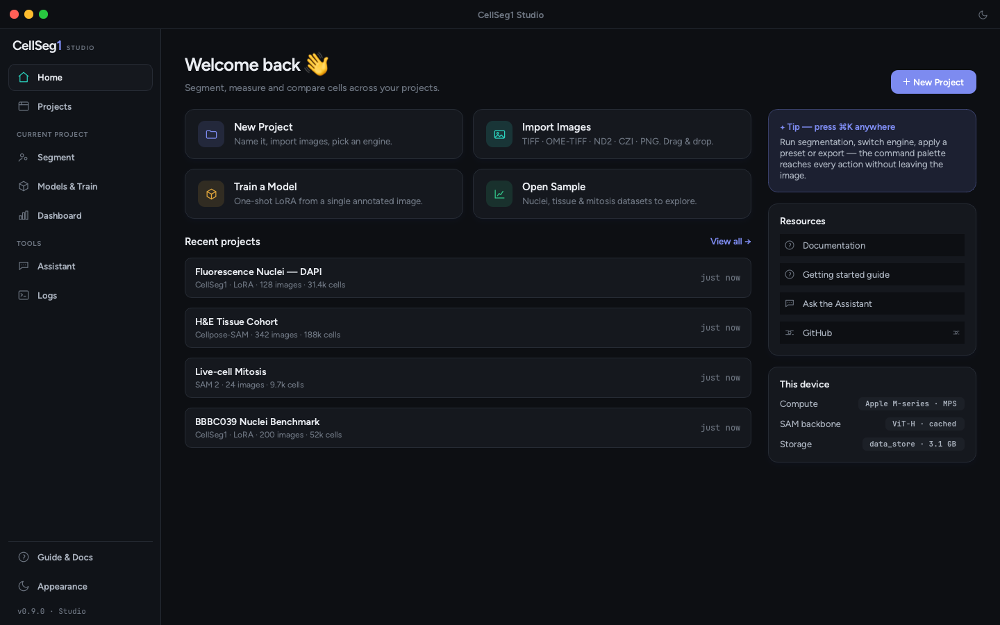
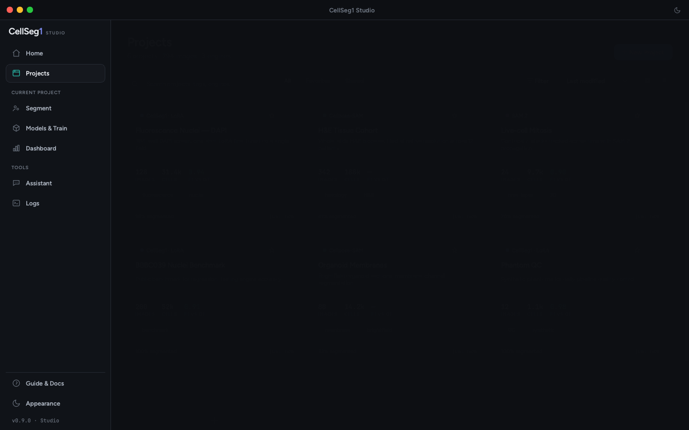
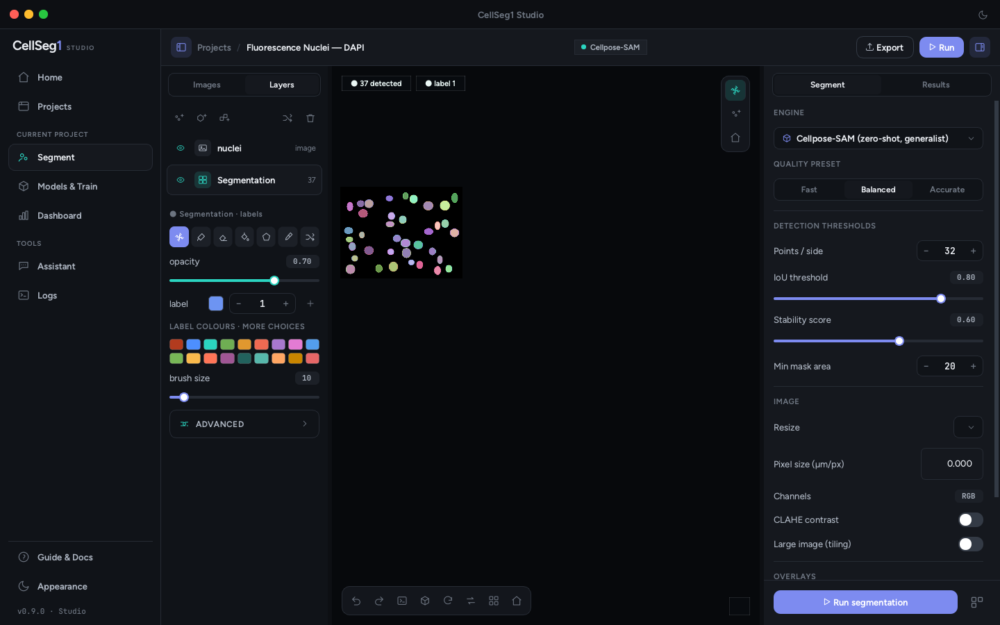

<p align="center">
  
</p>

<h1 align="center">Velum</h1>

<p align="center">
  <b>One-shot instance segmentation.</b> Annotate a single example and Velum
  learns to find and cut out that object everywhere — cells, tissue, or anything
  else. A desktop app, built for scientists, not ML engineers.
</p>

<p align="center">
  
  
  
  
</p>

<p align="center">
  
</p>

---

## What it is

Velum turns an image into labelled objects — annotate **one** example and its
one-shot LoRA engine learns to segment the rest, no big labelled dataset needed.
Everything downstream (per-object morphometry, cohort statistics, ground-truth
evaluation, export) works the same **regardless of which engine produced the
masks**. It's tuned for microscopy today (cells, nuclei, tissue), but the
one-shot engine isn't hard-wired to cells. Three interchangeable engines cover
the common cases:

| Engine | How it works | Best for |
| --- | --- | --- |
| **CellSeg1** | SAM ViT backbone + **LoRA**, one-shot fine-tuned from a *single* annotated image | Your own domain, no big labelled dataset |
| **Cellpose-SAM** | Zero-shot generalist, no training | Strong out-of-the-box accuracy |
| **SAM 2** | Zero-shot, mask propagation across planes | z-stacks & time-lapse |

The app owns its whole window — Home · Projects · **Segment** · Models & Train ·
Dashboard — with its **own** Qt image canvas and layer model (it is *not* an
embedded napari; nothing imports napari at runtime). The engine-agnostic ML core
lives in a separate, Qt-free package, [`velum_core/`](velum_core/).

## Screenshots

| Projects | Segment |
| --- | --- |
| [](docs/screenshots/projects.png) | [](docs/screenshots/segment.png) |

<sub>Rendered from the running app (offscreen). Light-theme variants are in
[`docs/screenshots/`](docs/screenshots/).</sub>

## Features

- **Three engines, one workflow** — switch engine per project; measurements,
  evaluation and export are identical downstream.
- **One-shot training** — fine-tune CellSeg1 from a single annotated image
  (LoRA), no dataset required.
- **A real editing canvas** — paint / erase / fill / polygon labels with
  undo-redo, adjustable contrast, per-instance colours; the cell count stays in
  sync with your edits.
- **Quantitative morphometry** — per-cell area, diameter, intensity and more
  (scikit-image regionprops), with µm calibration and CSV export.
- **Ground-truth evaluation** — F1 / precision / recall / AP against a reference
  mask, inline.
- **Batch & benchmark** — run a whole cohort, or benchmark engines vs
  ground truth.
- **Large images & volumes** — native-resolution tiled inference for big 2-D
  images; IoU-based slice stitching for z-stacks / time-lapse.
- **Offline Assistant** — a built-in diagnostic engine (optional local Ollama
  bridge), no cloud calls.
- **Hardware-aware** — detects real compute (CUDA capability, Apple MPS) instead
  of assuming.

## Install & run

Requires Python **3.10–3.12** and a real display. GPU optional (CPU works;
Apple-silicon MPS and CUDA are used when available).

```bash
# 1. Create the environment and fetch SAM weights (one time)
bash scripts/setup.sh         # or set up your own env, see below

# 2. Launch
bash run_studio.sh            # or: velum  /  cellseg1
```

Prefer your own environment?

```bash
pip install -e .              # installs the app + the `velum` launcher
velum
```

<sub>No conda / fresh Linux box? See [`AGENTS.md`](AGENTS.md) for a `uv`-based
setup.</sub>

### As a real macOS app (double-click, Dock icon)

Build a thin `.app` launcher once; after that you update it just by editing code
and relaunching — no rebuild:

```bash
bash scripts/make_app.sh      # -> dist/Velum.app
open "dist/Velum.app"
```

See **[docs/velum/PACKAGING.md](docs/velum/PACKAGING.md)** for the full story
(dev-launcher vs. a self-contained distributable, and how the icon works).

## Adding features (the update loop)

Studio is built so you add features by describing them, without re-packaging:

1. **Once:** build the dev-launcher `.app` (above). Keep it in the Dock.
2. **Each feature:** edit code under `studio/` (UI) — screens wire to plain,
   unit-tested controllers in `studio/*_controller.py`; the ML core is
   `velum_core/`.
3. **See it:** quit and relaunch from the Dock (or `bash run_studio.sh` for a
   terminal loop with live logs). Same `.app`, new code.
4. **Keep it green:** run the tests (below); add one for new logic.

Full guide: **[docs/velum/PACKAGING.md](docs/velum/PACKAGING.md)** ·
architecture and how to wire a tab: **[docs/velum/](docs/velum/)**.

## Architecture

```
studio/            The desktop app (PyQt6): screens, own canvas + layer model,
                   per-tab controllers. No napari.
velum_core/     Engine-agnostic ML core (Qt-free): predict controller,
                   engines (CellSeg1 / Cellpose-SAM / SAM2), analysis,
                   benchmark, cohort, training, tiling, volume stitching.
server/            Optional multi-user backend foundation (accounts, RBAC,
                   audit) — stdlib only, opt-in.
segment_anything/  Vendored SAM fork · peft/ LoRA · data/ IO  (repo-root ML libs)
docs/ · docs/velum/ Project docs and Studio-specific docs (design, packaging,
                   backlog, changelog)
```

## Tests

Pure-logic, offscreen, no GPU:

```bash
<python> -m pytest              # full suite (studio + core + server)
```

The CI "test" group is intentionally light (no torch/PyQt):
`pip install --group test && pytest tests/`.

## License

[Apache 2.0](LICENSE).
