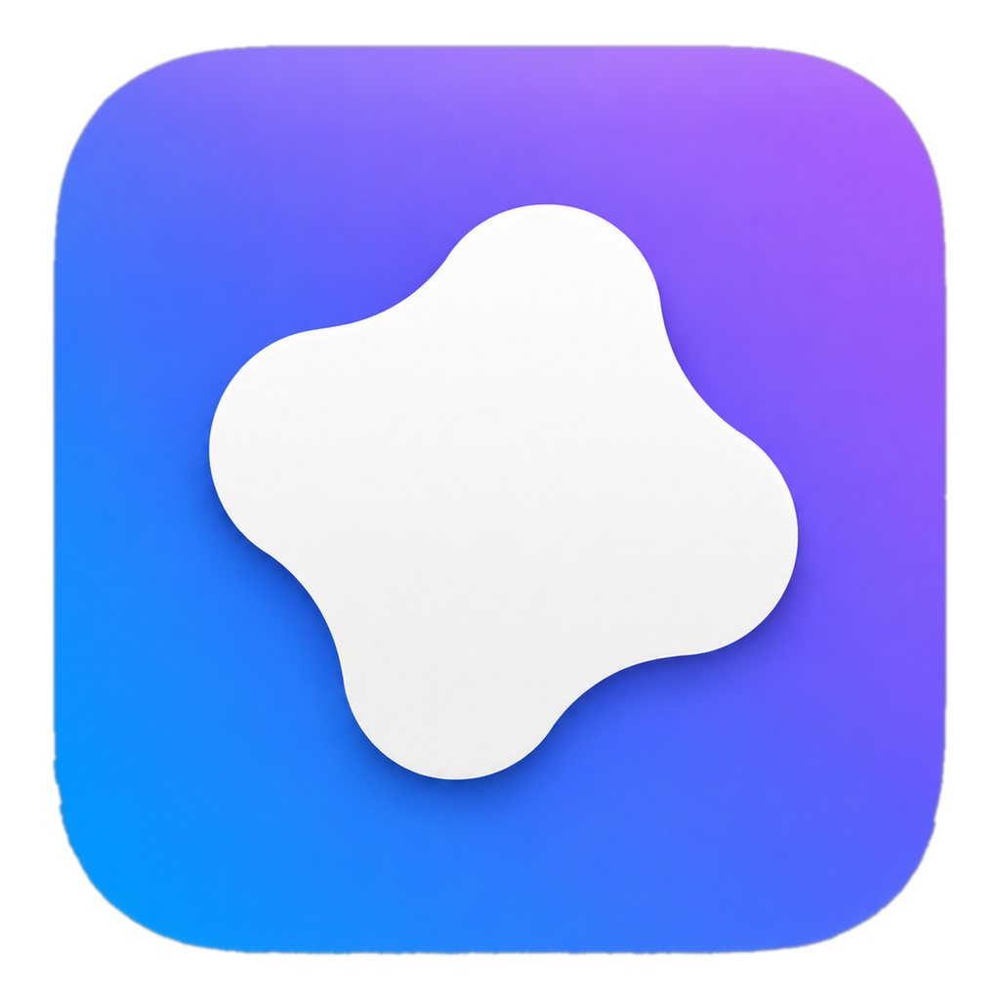

<p align="center">
  
</p>

# Velum — documentation

Velum is the standalone desktop app: a self-contained product that owns its
window (Home · Projects · Segment · Models & Train · Dashboard), with its
**own** image canvas (Segment's `studio/canvas.py` — explicitly *not* embedded
napari; see `ARCHITECTURE.md`). It replaces the "napari plugin in a dock"
experience. (The Python package is still named `studio/`; "Velum" is the
product name.)

This is Velum's own doc set (`docs/velum/`) — the app-specific subset of the
repo-wide `docs/` (which also carries the project-wide BACKLOG/AUDIT/CHANGELOG;
see [`../README.md`](../README.md) for the map). Read in this order:

1. **[OVERVIEW.md](OVERVIEW.md)** — what Studio is, where it stands (Phase 0 +
   1 done, Phase 2 in progress — see `ROADMAP.md`), how to run it, and the
   ground rules.
2. **[DESIGN.md](DESIGN.md)** — the visual identity: palette, type, tokens,
   components. The single source of truth for how Studio should look.
3. **[ARCHITECTURE.md](ARCHITECTURE.md)** — the module map and, crucially, **how
   to wire a tab** (turn a static screen into a real, functional one).
4. **[BACKLOG.md](BACKLOG.md)** — the tab-by-tab plan. Each tab is its own mini
   backlog with a task list. Pick a tab, do it end to end.
5. **[ROADMAP.md](ROADMAP.md)** — the phases from skeleton → full product.
6. **[CHANGELOG.md](CHANGELOG.md)** — what actually shipped, dated.
7. **[AGENT_PROMPT.md](AGENT_PROMPT.md)** — paste this to start a fresh agent
   session on Studio.

## TL;DR for a new contributor

- **Every screen from the mockup is reproduced in native Qt, and all of it is
  now real**: Home, Projects, Models & Train, Dashboard, Segment (own
  canvas + layer model, real predict/GT/batch/benchmark), Assistant (a
  real chat — offline diagnostics, Ollama, or any OpenAI-compatible Custom
  API — that can act on the Segment tab), Logs (a real, live stream from
  every tab's actual log lines — see `studio/log_bus.py`), and the ⌘K
  command palette (a real Spotlight-style action registry spanning every
  tab, fuzzy search, full keyboard navigation — see
  `studio/command_registry.py`) all run on live data/logic, not `demo.py`.
  P1 is fully done — check `BACKLOG.md`'s P2 ("polish & platform") for
  what's next.
- The goal now is **polish & platform** (P2): theme persistence, onboarding,
  a Settings screen, native rounded corners, packaging — tracked in
  `BACKLOG.md`.
- **Velum is THE product.** The old `napari_app/` plugin UI has been deleted;
  its engine-agnostic ML core moved to `velum_core/` (Qt-free, no napari),
  which Velum imports as its backend. There is no separate "classic app" any
  more — this is it.

## Run it

```bash
bash run_studio.sh          # or:  velum  /  cellseg1  (after pip install -e .)
```

Real inference needs SAM weights + deps — see `scripts/setup.sh`. The UI itself
launches on PyQt6 alone.
